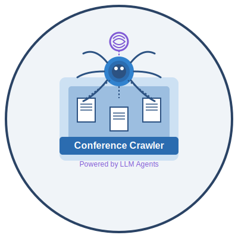

# 🎓 Agentic Conference Crawler

<div align="center">
  
  
  
  
  
</div>

<p align="center">
  
</p>

An intelligent, agentic system for monitoring academic conferences across various research areas. The system automatically collects, validates, and presents conference data, including deadlines, locations, and rankings, while eliminating duplicates and outdated entries.

## ✨ Features

- 🔍 **Intelligent Conference Discovery**: Automatically finds and tracks academic conferences across multiple research areas
- 🗂 **Tiered Conference Ranking**: Classifies conferences by quality (A\*, A, B, C tiers)
- 📅 **Smart Deadline Tracking**: Monitors submission deadlines and important dates
- 🧠 **Research Area Categorization**: Organizes conferences by research domains
- 🔄 **Deduplication**: Ensures each conference appears only once, even if found from multiple sources
- 📱 **Modern UI**: Clean, responsive interface built with React and Material UI
- 💾 **Database Integration**: SQLite storage for better performance and reliability
- 🤖 **AI-Powered Queries**: Natural language interface for advanced searches

## 🏗 System Architecture

The Agentic Conference Crawler consists of two main components:

1. **Backend**: A Python Flask application that handles:

   - Conference data collection and processing
   - Database management
   - API endpoints
   - Natural language processing

2. **Frontend**: A React application that provides:
   - User interface for viewing and filtering conferences
   - Data visualization
   - Search capabilities
   - Research area management

## 🚀 Getting Started

### Prerequisites

- Python 3.9+
- Node.js 16+
- npm 8+

### Backend Installation

1. Clone the repository:

   ```bash
   git clone https://github.com/yourusername/Agentic_Conference_Crawler.git
   cd Agentic_Conference_Crawler
   ```

2. Create and activate a virtual environment:

   ```bash
   python -m venv venv

   # On Windows
   venv\Scripts\activate

   # On macOS/Linux
   source venv/bin/activate
   ```

3. Install Python dependencies:

   ```bash
   pip install -r requirements.txt
   ```

4. Create a `.env` file in the project root with the following content:
   ```
   FLASK_APP=conference_monitor.api.app
   FLASK_ENV=development
   API_KEY=your_api_key_here
   ```

### Frontend Installation

1. Navigate to the frontend directory:

   ```bash
   cd frontend
   ```

2. Install Node.js dependencies:
   ```bash
   npm install
   ```

## 🏃‍♂️ Running the Application

### Backend Server

1. From the project root directory with the virtual environment activated:
   ```bash
   flask run
   ```
   The backend server will start on http://localhost:5000

### Frontend Development Server

1. In a separate terminal, navigate to the frontend directory:

   ```bash
   cd frontend
   ```

2. Start the development server:
   ```bash
   npm run dev
   ```
   The frontend will be available at http://localhost:5173

## 📖 Using the Application

### Homepage

The homepage provides an overview of the system's features and quick access to all functionality.

### Conferences Page

The Conferences page displays upcoming academic conferences with the following features:

1. **Filtering**:

   - By Research Area: Select a specific research domain
   - By Tier: Filter conferences by quality ranking (A\*, A, B, C)

2. **Conference Cards**:

   - **Title**: Name of the conference
   - **Tier Badge**: Color-coded quality ranking
   - **Dates**: When the conference will take place
   - **Research Areas**: Related domains (clickable)
   - **Location**: Where the conference will be held
   - **Deadlines**: Important submission dates
   - **Website Link**: Direct access to the conference site

3. **Refreshing Data**:
   - Click "Refresh Conferences" to fetch the latest conference information
   - The system will automatically deduplicate entries and filter out past conferences

### Interpreting Conference Tiers

Conferences are ranked according to their quality and prestige:

- **A\* (Red)**: Top-tier, flagship conferences in the field
- **A (Orange)**: Excellent conferences with high impact
- **B (Green)**: Good quality conferences
- **C (Blue)**: Regular conferences and workshops

### Managing Research Areas

The system tracks conferences in multiple research domains. You can:

1. View all currently tracked research areas
2. Add new research areas to monitor
3. Remove research areas no longer of interest

## 🔌 API Documentation

The system provides a RESTful API for programmatic access:

| Endpoint                   | Method | Description                                        |
| -------------------------- | ------ | -------------------------------------------------- |
| `/api/status`              | GET    | Check API status                                   |
| `/api/conferences`         | GET    | Get all conferences (optional filters: area, tier) |
| `/api/conferences/refresh` | POST   | Refresh conference data                            |
| `/api/papers`              | GET    | Get all tracked papers                             |
| `/api/papers/refresh`      | POST   | Refresh paper data                                 |
| `/api/trends`              | GET    | Get trending topics                                |
| `/api/query`               | POST   | Run a direct query                                 |
| `/api/research-areas`      | GET    | Get tracked research areas                         |
| `/api/research-areas`      | POST   | Update tracked research areas                      |

## 🗄 Data Storage

The system uses two storage mechanisms:

1. **SQLite Database**:

   - Primary storage for conferences and papers
   - Located at `data/conference_monitor.db`
   - Provides efficient querying and filtering

2. **JSON Files** (for backward compatibility):
   - Conference data: `data/conferences/`
   - Paper data: `data/papers/`
   - Metadata: `data/metadata.json`

## 🛠 Customization

### Adding New Conference Sources

The system can be extended to support additional conference sources by:

1. Adding new URLs to the `default_sources` list in `ConferenceSearchTool`
2. Implementing source-specific parsing in the `_build_search_url` method

### Customizing Conference Tiers

The tiering system can be adjusted in `_generate_sample_conferences` within the `MonitorService` class.

## 🤝 Contributing

Contributions are welcome! Please feel free to submit a Pull Request.

## Frontend

The project includes a React frontend that provides a user-friendly interface for interacting with the Conference Monitor API.

### Frontend Features:

- Home page with quick access to all features
- Conference listing and filtering
- Research paper management
- Trending topics visualization
- AI-powered query interface
- Dark mode support
- Responsive design for mobile and desktop

### Running the Frontend:

1. Navigate to the frontend directory:

   ```
   cd frontend
   ```

2. Install dependencies:

   ```
   npm install
   ```

3. Start the development server:

   ```
   npm run dev
   ```

4. Access the frontend in your browser at `http://localhost:5173`

### Frontend Technology Stack:

- React.js - UI library
- Material UI - Component library
- React Router - Navigation
- Axios - API communication

## 📄 License

This project is licensed under the MIT License.
